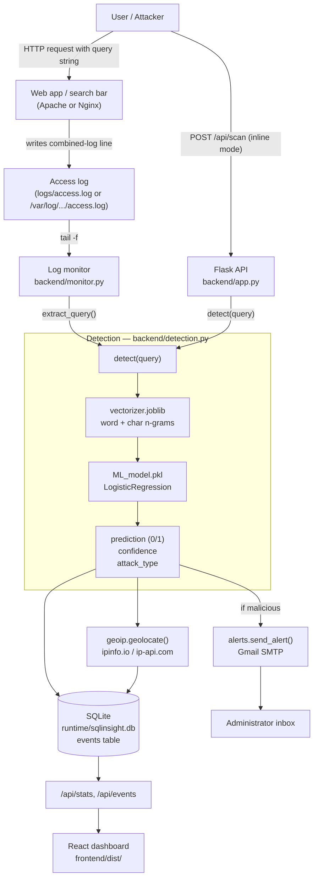

# SQLInsight — Architecture

SQLInsight is a machine-learning Intrusion Detection System (IDS) for SQL-injection
attacks against web applications. It reproduces and improves on the bachelor thesis
*"Machine Learning-Based Intrusion Detection System for Detecting SQL Injection
Attacks in Web Applications"* (Alqaiyas Qasim Al Sulaimi, German University of
Technology in Oman) by Alqaiyas Qasim Al Sulaimi. The thesis deploys a logistic-regression detector behind a
WordPress + Apache site, tails the Apache access log with `tail -f`, and raises
email alerts; SQLInsight keeps that design faithfully and adds a single-process,
"clone and run" packaging plus a richer React dashboard.

This document describes the system at a high level: the end-to-end data flow, how
the nine pipeline stages from the thesis map onto concrete files, each component,
the SQLite schema, the HTTP API contract, and the two detection modes.

---

## 1. High-level overview

SQLInsight is a single Flask application (`backend/app.py`) that:

1. Serves a pre-built React dashboard from `frontend/dist/`.
2. Exposes a small JSON REST API (`/api/...`).
3. Classifies query strings with a pre-trained scikit-learn pipeline
   (a `CountVectorizer` feature union + `LogisticRegression`), loaded from
   `ml/artifacts/`.
4. Persists every inspected request to an embedded SQLite database
   (`runtime/sqlinsight.db`).
5. Optionally enriches detections with IP geolocation and fires Gmail email alerts.

A second, standalone entry point (`backend/monitor.py`) implements the
thesis-faithful **`tail -f` log monitor**: it follows an Apache/Nginx access log,
extracts the query string from each request, runs the *same* model, and writes to
the *same* SQLite database. Both detection paths therefore feed one shared event
store that the dashboard visualises.

Everything required to run is committed to the repository: the model is
pre-trained (`ml/artifacts/ML_model.pkl` + `vectorizer.joblib`) and the React app
is pre-built into `frontend/dist/`. On a fresh macOS machine the only setup step is
`pip install -r requirements.txt` — no Node build, no model training.

### Data flow



The key invariant: the malicious/benign **verdict always comes from the ML model**.
The regex `classify_attack_type` only adds a human-readable category (e.g.
"Union-based") for display; it never decides whether something is an attack.

---

## 2. Thesis pipeline → implementation map

The thesis (Chapter 4.2, "System Architecture") defines a protection layer made of
nine numbered stages. Each maps to a concrete module/function in this repository:

| # | Thesis stage | Implemented in | Notes |
|---|--------------|----------------|-------|
| 1 | **Data Collection** | `data/Modified_SQL_Dataset.csv`, `data/clean_sql_dataset.csv`; loaded by `ml/preprocess.py:load_dataset()` | Labelled `{Query, Label}` CSVs (1 = malicious, 0 = benign). See [DATASET.md](DATASET.md). |
| 2 | **Cleaning & Pre-Processing** | `ml/preprocess.py:load_dataset()` | Normalises columns, coerces types, drops NA/empty rows, robust non-UTF-8 decoding (`encoding_errors="replace"`). |
| 3 | **Feature Extraction** | `ml/preprocess.py:build_vectorizer()` | `FeatureUnion` of word 1–2 grams (SQL-aware token pattern) + `char_wb` 3–5 grams, then `VarianceThreshold`. |
| 4 | **Training & Testing** | `ml/train_model.py:main()` | 80/20 stratified split (`train_test_split`, `random_state=42`) for Experiment 1; final model fit on 100% of training data for deployment. |
| 5 | **Evaluate Model** | `ml/train_model.py:_scores()` | Accuracy / precision / recall / F1 + confusion matrix. Results in `ml/artifacts/metrics.json`. |
| 6 | **Save / Export** | `ml/train_model.py` (`joblib.dump`) | Writes `ML_model.pkl`, `vectorizer.joblib`, `metrics.json` — matching the thesis's separate model + vectorizer artifacts. |
| 7 | **Integrate Web App with Model** | `backend/app.py` + `backend/detection.py` | Model loaded once (cached) and called inline from `POST /api/scan`. |
| 8 | **Parse Logs** | `backend/accesslog.py` (`extract_ip`, `extract_query`, `extract_user_agent`) + `backend/monitor.py` | Combined-log parsing; `extract_query` is faithful to the thesis server code (Appendix B). |
| 9 | **Detect / Alert** | `backend/detection.py:detect()`, `backend/alerts.py:send_alert()`, `backend/geoip.py` | Verdict from the model; on malicious, enrich with geo and email the admin. |
| — | **Dashboard (Stage "11")** | `frontend/` (built to `frontend/dist/`), data from `backend/database.py:get_stats()` via `/api/stats` | Real-time monitoring UI: totals, time series, attack types, geography. |

> The thesis numbers its dashboard stage "11" (Stages 10 is skipped in the source
> document); functionally it is the tenth and final stage.

---

## 3. Components

### Configuration — `config.py`
Single source of truth for paths and settings. Loads `.env` (via `python-dotenv`)
if present, otherwise relies on environment variables with safe defaults. Defines
artifact paths, dataset paths, the SQLite path (`runtime/sqlinsight.db`), the
access-log path (`ACCESS_LOG_PATH`, default `logs/access.log`), web-server host/port,
Gmail SMTP settings, the alert cooldown, and the optional `IPINFO_TOKEN`. Creates
`logs/`, `runtime/`, and `ml/artifacts/` on import. `VERSION = "1.0.0"`.

### ML pipeline — `ml/`
- **`ml/preprocess.py`** — shared by both training and inference so the exact same
  transformation is applied everywhere. `load_dataset()` robustly loads a
  `{Query, Label}` CSV; `build_vectorizer()` constructs the (unfitted) feature
  `Pipeline`. The SQL-aware token pattern is `(?u)\b\w+\b|[^\w\s]`, which keeps
  punctuation such as `'`, `"`, `--`, `=`, `;`, `(`, `)` as tokens.
- **`ml/train_model.py`** — trains, evaluates (Experiment 1, Experiment 2 full,
  Experiment 2 unseen-only), and persists the three artifacts.
- **`ml/artifacts/`** — committed pre-trained artifacts: `ML_model.pkl`,
  `vectorizer.joblib`, `metrics.json`.

See [MODEL.md](MODEL.md) for the full ML detail and results.

### Detection service — `backend/detection.py`
Loads `ML_model.pkl` and `vectorizer.joblib` separately (matching the thesis
deployment) and caches them with `functools.lru_cache`. `detect(query)` runs
`model.predict_proba(vectorizer.transform([query]))`, applies the decision
`THRESHOLD = 0.5` on `P(malicious)`, and returns:

```json
{"query": "...", "prediction": 0|1, "confidence": 0.0-1.0,
 "verdict": "Normal"|"Suspicious", "attack_type": "..."|null}
```

`classify_attack_type()` is a descriptive regex classifier with nine categories:
Tautology / Auth Bypass, Union-based, Stacked Queries, Time-based Blind,
Error-based, Command Execution, Comment Injection, Schema Enumeration, and a
"Generic / Obfuscated" fallback. `model_loaded()` reports whether artifacts are
available (used by `/api/health`).

### Flask app — `backend/app.py`
Hosts the REST API and serves the SPA. Calls `database.init_db()` at startup.
Routes: `GET /api/health`, `GET /api/model`, `POST /api/scan`, `GET /api/events`,
`GET /api/stats`, plus a catch-all that serves `frontend/dist/index.html` (with a
helpful fallback page if the dashboard has not been built). Runs threaded; debug is
gated behind the `FLASK_DEBUG` env var. See [API.md](API.md).

### Event store — `backend/database.py`
Thread-local SQLite connections (`check_same_thread=False`, `Row` factory). Defines
the `events` schema (below), `insert_event()`, `recent_events()`, and `get_stats()`.
`get_stats()` computes totals, a 24-hour hourly time series, and breakdowns by
attack type, country, and top source IPs — all from the `events` table.

### Log monitor — `backend/monitor.py`
Standalone thesis-faithful follower. Uses `tail -f -n 0 <path>` via `subprocess`
when available, and falls back to a pure-Python tail (seek-to-end + poll) when
`tail` is missing (e.g. on Windows). For each new line it extracts the query,
classifies it, and on a malicious verdict records the event and fires an alert.

### Access logging & parsing — `backend/accesslog.py`
`write_access_log()` appends an Apache combined-log line for every API request so
the standalone monitor always has a realistic feed to tail. `extract_ip()`,
`extract_query()`, and `extract_user_agent()` parse log lines; `extract_query()`
returns the URL-decoded value of the first query-string parameter (e.g. `q=...`).

### Email alerts — `backend/alerts.py`
`send_alert(event)` sends an HTML + plain-text security alert over Gmail SMTP
(`smtp.gmail.com:587`, STARTTLS). It includes timestamp, source IP, geolocation,
attack type, confidence, and the raw log line. A per-IP cooldown
(`ALERT_COOLDOWN_SECONDS`, default 60s) prevents alert storms. Alerting is a no-op
unless `ALERTS_ENABLED=true` and SMTP credentials are set, and it is wrapped so it
can never crash detection.

### Geolocation — `backend/geoip.py`
`geolocate(ip)` returns `{country, region, city, lat, lon}`. Uses ipinfo.io when
`IPINFO_TOKEN` is set (matching the thesis), otherwise the token-less ip-api.com.
Private/loopback IPs resolve locally to `Local / Private / localhost` without a
network call. Results are cached in memory (`lru_cache`).

### Demo generator — `backend/simulate_traffic.py`
Posts a realistic mix of benign and malicious requests to `POST /api/scan` so the
dashboard populates with live detections, attack types, and geographic spread.
Configurable count and malicious ratio, plus a continuous `loop` mode.

### Frontend — `frontend/`
A React 19 + TypeScript single-page app built with Vite, styled with Tailwind CSS,
charts via `recharts`, icons via `lucide-react`. `frontend/src/types.ts` mirrors the
backend JSON shapes. The production build is committed to `frontend/dist/`
(intentionally not gitignored) so Flask can serve it with Python only. Vite uses a
relative `base: './'` so the bundle works from any mount point, and a dev proxy
forwards `/api` to `http://127.0.0.1:5000`.

---

## 4. SQLite `events` schema

Defined in `backend/database.py`. Every inspected request — from both the inline API
and the log monitor — is one row:

| Column | Type | Description |
|--------|------|-------------|
| `id` | INTEGER PK AUTOINCREMENT | Event id. |
| `ts` | TEXT (NOT NULL) | UTC timestamp, ISO `YYYY-MM-DDTHH:MM:SSZ`. |
| `query` | TEXT (NOT NULL) | The inspected query string / payload. |
| `prediction` | INTEGER (NOT NULL) | `1` = malicious, `0` = benign (from the model). |
| `confidence` | REAL (NOT NULL) | `P(malicious)`, 0.0–1.0. |
| `verdict` | TEXT (NOT NULL) | `"Suspicious"` or `"Normal"`. |
| `attack_type` | TEXT | Descriptive category, or `NULL` when benign. |
| `source_ip` | TEXT | Client IP. |
| `method` | TEXT | HTTP method. |
| `path` | TEXT | Request path. |
| `user_agent` | TEXT | Client User-Agent. |
| `country` | TEXT | Geolocation country (code or name). |
| `region` | TEXT | Geolocation region. |
| `city` | TEXT | Geolocation city. |
| `lat` | REAL | Latitude. |
| `lon` | REAL | Longitude. |
| `source` | TEXT | Origin tag: `scanner`, `monitor`, `demo`, etc. |
| `alerted` | INTEGER (DEFAULT 0) | `1` if an email alert was actually sent. |

Indexes: `idx_events_ts` on `ts`, `idx_events_pred` on `prediction`.

---

## 5. API contract (summary)

Full reference with request/response examples in [API.md](API.md).

| Method | Path | Purpose | Key params / body |
|--------|------|---------|-------------------|
| `GET` | `/api/health` | Service + model status | — |
| `GET` | `/api/model` | Model metadata + all metrics (`metrics.json`) | — |
| `POST` | `/api/scan` | Classify a query; persist event; maybe alert | body: `{query, source_ip?, source?, method?, user_agent?, path?}` |
| `GET` | `/api/events` | Recent events | `?limit=` (max 500), `?verdict=Suspicious|Normal` |
| `GET` | `/api/stats` | Aggregated dashboard stats | — |
| `GET` | `/` and `/<path>` | Serve the React SPA | — |

---

## 6. The two detection modes

SQLInsight detects attacks via two complementary paths that share one model and one
database. They can run together (e.g. the monitor tails the same log the API writes).

### Mode A — Inline API (`POST /api/scan`)
Synchronous classification on demand. A caller (the demo generator, a security
scanner, or a web app integrated to call SQLInsight) sends a query; the server
classifies it, geolocates the IP, **also appends an Apache-style line to the access
log** (so Mode B has a feed), persists the event, optionally emails an alert, and
returns the full event JSON. Best for integration testing and driving the dashboard.

### Mode B — Standalone `tail -f` monitor (`backend/monitor.py`)
The thesis-faithful production path. Point it at a real web-server access log:

```bash
python backend/monitor.py /var/log/apache2/access.log
```

It tails the file with `tail -f`, extracts the query string from each request,
classifies it, and on a malicious verdict records the event and fires an email
alert — exactly the server-side deployment described in the thesis (Appendix B),
generalised to also feed the dashboard database. With no argument it tails
`ACCESS_LOG_PATH` from `.env` (default `logs/access.log`, the demo log the API
itself writes).

| | Mode A: Inline API | Mode B: `tail -f` monitor |
|---|---|---|
| Entry point | `backend/app.py` (`POST /api/scan`) | `backend/monitor.py` |
| Trigger | Incoming HTTP POST | New line appended to access log |
| Query source | JSON `query` field | `extract_query()` from the log line |
| Writes to access log? | Yes (feeds Mode B) | No (it reads the log) |
| Writes to SQLite? | Yes | Yes |
| Fires email alerts? | Yes (on malicious) | Yes (on malicious) |
| Typical use | Demos, scanners, app integration | Production monitoring of a live server |

---

## 7. Technology stack

- **Language:** Python 3.12+ (thesis specifies Python 3.12 on macOS 64-bit).
- **ML:** scikit-learn `1.8.0` (pinned for pickle compatibility), NumPy, SciPy,
  pandas, joblib.
- **Backend:** Flask 3, `requests`, `python-dotenv`.
- **Storage:** SQLite (Python standard library `sqlite3`).
- **Frontend:** React 19, TypeScript, Vite 6, Tailwind CSS 3, recharts, lucide-react.
- **External services (optional):** Gmail SMTP (alerts), ipinfo.io / ip-api.com
  (geolocation).
