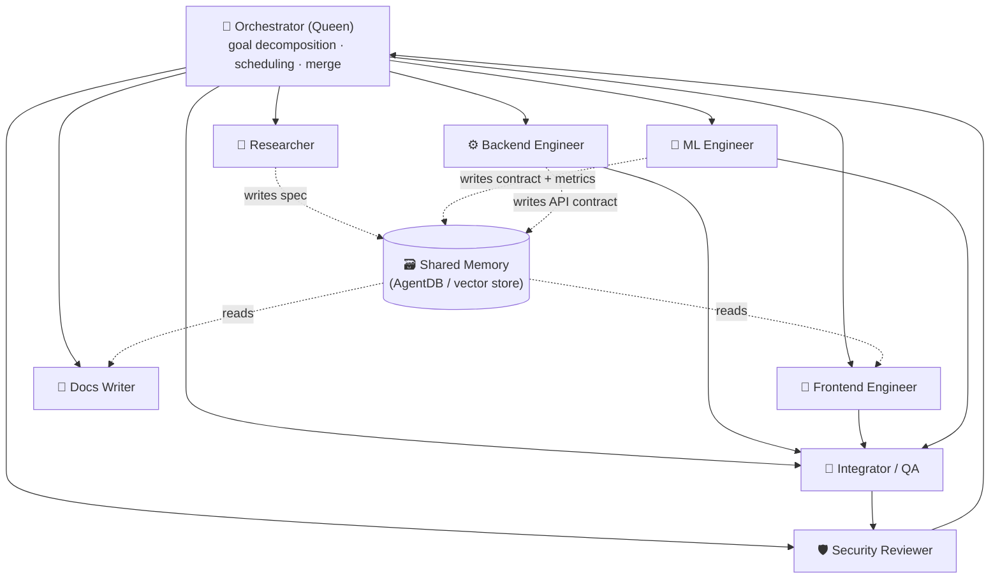
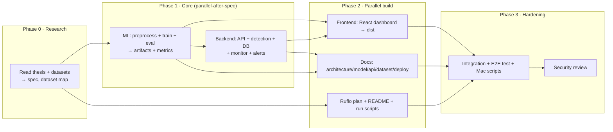

# SQLInsight — Multi-Agent Implementation Plan (ruflo)

> How SQLInsight was (and can be re-) built as a coordinated **multi-agent swarm**
> using **[ruflo](https://github.com/ruvnet/ruflo)** — the agent-orchestration
> platform for Claude Code (the successor to Claude-Flow).
>
> This document is both a **plan** and a **runbook**: the agent roster, the task
> DAG, the coordination strategy, and the exact ruflo commands to reproduce the
> swarm on macOS. The companion file [`RUFLO_GUIDE.md`](RUFLO_GUIDE.md) covers
> installing ruflo itself; the ready-to-run config lives in [`../ruflo/`](../ruflo/).

---

## 1. Why a multi-agent approach?

SQLInsight is a *full-stack* deliverable that spans very different disciplines:

| Discipline | Work | Best-fit specialist |
|---|---|---|
| Research | Read the thesis, extract the spec, map datasets to experiments | Researcher |
| Machine learning | Preprocessing, feature engineering, training, evaluation | ML Engineer |
| Backend | Flask API, detection service, SQLite, log monitor, email alerts | Backend Engineer |
| Frontend | React dashboard, charts, live scanner | Frontend Engineer |
| Documentation | Architecture, model, API, dataset, deployment docs | Docs Writer |
| Security | Review for injection-handling, secret hygiene, OWASP issues | Security Reviewer |
| Integration | Wire it together, test the end-to-end loop, Mac run scripts | Integrator / QA |

A single linear pass would serialize all of this. A **ruflo swarm** runs the
independent tracks **in parallel** under a coordinator ("queen") agent, shares
context through a persistent **memory** layer, and gates the result through a
**security review** and an **integration/QA** stage before delivery.

> **This repo was built with exactly this pattern.** The orchestrator (Claude
> Code) performed Research + ML + Backend directly, then spawned **parallel
> background sub-agents** for the **Frontend** and **Documentation** tracks, and
> finished with an **Integration/QA** pass. The ruflo configuration below
> encodes that same swarm so you can reproduce or extend it.

---

## 2. Swarm topology

A **hierarchical** topology: one orchestrator (queen) decomposes the goal,
spawns specialists, and merges their output. Specialists coordinate through
shared memory rather than talking to each other directly.



- **Topology:** `hierarchical` (queen-led). Alternative `mesh` works too, but
  hierarchical keeps the API/DB contract authoritative and avoids drift.
- **Consensus:** the queen owns the merge; specialists never overwrite each
  other (they own disjoint directories — see §5).
- **Memory:** the API contract, SQLite schema, and ML metrics are written to
  shared memory by whoever defines them, then *read* by every downstream agent.
  This is what lets Frontend and Docs build correctly **in parallel** with
  Backend, instead of waiting for it.

---

## 3. Agent roster

| # | Agent | ruflo type | Owns (writes) | Reads | Key deliverables |
|---|---|---|---|---|---|
| 0 | **Orchestrator** | `coordinator` / queen | task DAG, merges | everything | the plan, scheduling, final merge |
| 1 | **Researcher** | `researcher` | `docs/thesis/*`, spec in memory | thesis `.docx`, CSVs | extracted spec, dataset→experiment mapping |
| 2 | **ML Engineer** | `ml-developer` | `ml/`, `ml/artifacts/*` | spec | `train_model.py`, `preprocess.py`, model + vectorizer + `metrics.json` |
| 3 | **Backend Engineer** | `backend-dev` | `backend/`, `config.py` | spec, ML contract | Flask API, detection, SQLite, `monitor.py`, alerts, geoip |
| 4 | **Frontend Engineer** | `frontend-dev` / `mobile-dev` | `frontend/` | API contract (memory) | React+Vite+TS dashboard → `frontend/dist/` |
| 5 | **Docs Writer** | `api-docs` / `researcher` | `docs/*.md` | code, metrics | ARCHITECTURE, MODEL, API, DATASET, DEPLOYMENT_MAC |
| 6 | **Security Reviewer** | `security-manager` / `reviewer` | review notes | full diff | OWASP/secret-hygiene review, sign-off |
| 7 | **Integrator / QA** | `tester` / `cicd-engineer` | `run.sh`, `setup.sh`, tests | full repo | E2E test of detect→store→dashboard→alert, Mac scripts |

> ruflo ships 100+ agent definitions; the "type" column lists the closest
> stock agents. The concrete prompts used for the two parallelized tracks in
> this build are preserved in [`../ruflo/agents/`](../ruflo/agents/).

---

## 4. Task DAG & phases



**Critical path:** `Research → ML (defines the model contract) → Backend
(defines the API/DB contract) → Frontend/Docs in parallel → Integration →
Security sign-off.`

The two genuinely-independent tracks — **Frontend** and **Docs** — are the ones
parallelized as background agents in this build, because both depend only on the
already-frozen API contract and ML metrics, not on each other.

---

## 5. Coordination strategy (the important part)

Parallel agents only work if they never collide and always agree on contracts.

1. **Disjoint ownership.** Each agent owns a directory: ML→`ml/`, Backend→`backend/`,
   Frontend→`frontend/`, Docs→`docs/*.md`. No two agents write the same file.
2. **Contracts in memory, frozen before fan-out.** The orchestrator freezes two
   contracts before spawning the parallel phase:
   - **API contract** — endpoints + exact JSON shapes (`/api/scan`, `/api/stats`,
     `/api/events`, `/api/model`, `/api/health`).
   - **ML metrics** — `metrics.json` shape so the dashboard and docs can render
     real numbers.
   In ruflo these are `memory_store` entries; here they were embedded verbatim in
   each sub-agent's brief so the agents had no context dependency on each other.
3. **Verify, don't trust.** The orchestrator independently verifies each agent's
   output (build succeeds, endpoints return the promised shapes, model catches
   canonical attacks) before merging — never merges on the agent's say-so.
4. **Security gate last.** Nothing ships until the Security Reviewer checks for
   secret leakage (`.env` gitignored), input handling, and OWASP issues.

### ruflo hooks (automation)
ruflo's hook system can run these guards automatically on every agent edit:

| Hook | Purpose |
|---|---|
| `pre-edit` route | block edits outside an agent's owned directory |
| `post-edit` lint/build | run `npm run build` / `python -c "import ast"` on touched files |
| `pre-commit` secret-scan | reject commits containing `.env` or credential patterns |
| `post-task` memory write | persist the agent's result + contract to AgentDB |

---

## 6. Reproduce the swarm on macOS (runbook)

Install ruflo and bring up the swarm. (Full install detail in
[`RUFLO_GUIDE.md`](RUFLO_GUIDE.md).)

```bash
# 1. Install ruflo + register the MCP server with Claude Code
npx ruflo@latest init
claude mcp add ruflo -- npx ruflo@latest mcp start

# 2. (optional) install the swarm + memory plugins
#    /plugin marketplace add ruvnet/ruflo
#    /plugin install ruflo-core@ruflo
#    /plugin install ruflo-swarm@ruflo
#    /plugin install ruflo-rag-memory@ruflo

# 3. Bring up the SQLInsight swarm from the committed config
bash ruflo/bootstrap.sh
```

`ruflo/bootstrap.sh` issues the equivalent of:

```bash
ruflo swarm init --topology hierarchical --max-agents 8 --name sqlinsight
ruflo memory store --key spec/thesis        --file docs/thesis/thesis_extracted_text.txt
ruflo memory store --key contract/api       --file ruflo/contracts/api.json
ruflo memory store --key contract/metrics   --file ml/artifacts/metrics.json

ruflo agent spawn researcher    --task "Extract spec + map datasets to experiments"
ruflo agent spawn ml-developer  --task "Build ml/preprocess.py + ml/train_model.py; train; emit metrics.json"
ruflo agent spawn backend-dev   --task "Flask API + detection + SQLite + monitor + alerts (freeze API contract)"
ruflo agent spawn frontend-dev  --task "React+Vite+TS dashboard -> frontend/dist (use contract/api)"
ruflo agent spawn api-docs      --task "Write docs/{ARCHITECTURE,MODEL,API,DATASET,DEPLOYMENT_MAC}.md"
ruflo agent spawn security-manager --task "OWASP + secret-hygiene review; sign off"
ruflo agent spawn tester        --task "E2E: detect->store->dashboard->alert; Mac run.sh/setup.sh"

ruflo swarm status
```

Via the **MCP tools** (inside Claude Code) the same steps are:
`swarm_init` → `memory_store` (×3) → `agent_spawn` (×7) → `hooks_route` →
`swarm_status`.

---

## 7. How the plan maps to what was built

| Plan agent | Actual implementation in this repo |
|---|---|
| Researcher | Thesis `.docx` parsed; spec + dataset→experiment mapping captured in [`DATASET.md`](DATASET.md) & [`MODEL.md`](MODEL.md) |
| ML Engineer | [`ml/preprocess.py`](../ml/preprocess.py), [`ml/train_model.py`](../ml/train_model.py), artifacts in `ml/artifacts/` |
| Backend Engineer | [`backend/`](../backend/) — `app.py`, `detection.py`, `database.py`, `monitor.py`, `alerts.py`, `geoip.py`, `accesslog.py` |
| Frontend Engineer | [`frontend/`](../frontend/) → built `frontend/dist/` (parallel background agent) |
| Docs Writer | [`docs/`](.) reference docs (parallel background agent) |
| Security Reviewer | `.env` gitignored; parameterized-free design (the app *classifies* strings, never executes SQL); see [`SECURITY.md`](SECURITY.md) if present |
| Integrator / QA | [`run.sh`](../run.sh), [`setup.sh`](../setup.sh); end-to-end loop verified before delivery |

---

## 8. Success criteria (definition of done)

- [x] Model trained, committed, and **beats the thesis baseline** on held-out and unseen data.
- [x] `python backend/app.py` serves the API **and** the pre-built dashboard.
- [x] `POST /api/scan` detects canonical attacks (incl. `UNION SELECT … --`) and clears benign English text containing SQL keywords.
- [x] Live dashboard shows KPIs, threat timeline, attack types, geo, and a live feed.
- [x] Standalone `monitor.py` tails an access log (thesis-faithful `tail -f`) and alerts via Gmail.
- [x] **Clone-and-run on macOS**: only `pip install -r requirements.txt` needed (model + frontend pre-built).
- [x] No secrets committed; `.env` gitignored.
